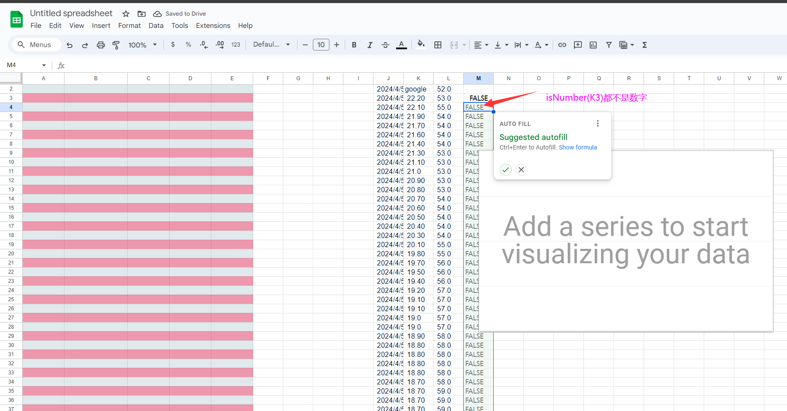
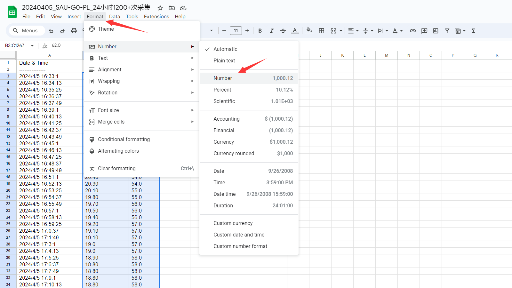
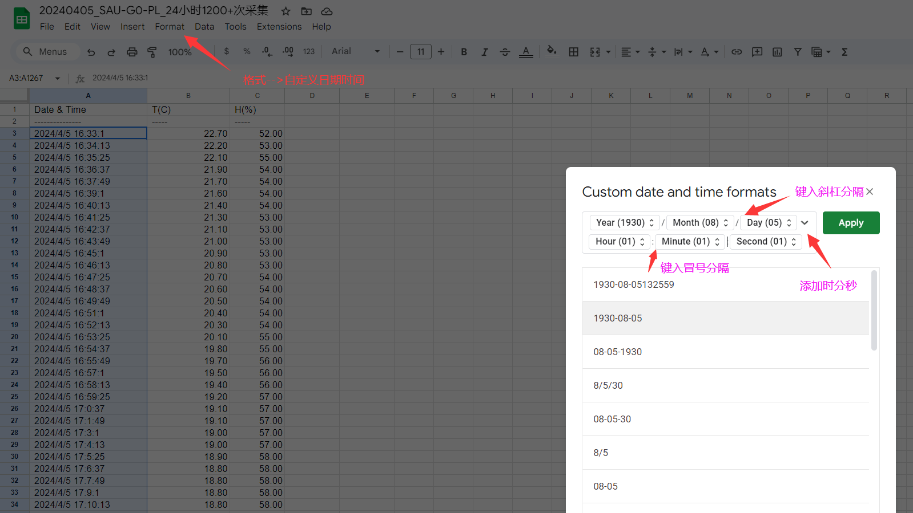
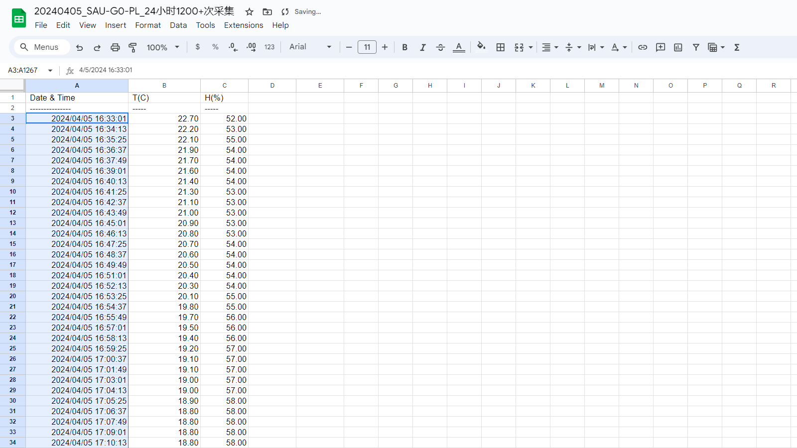
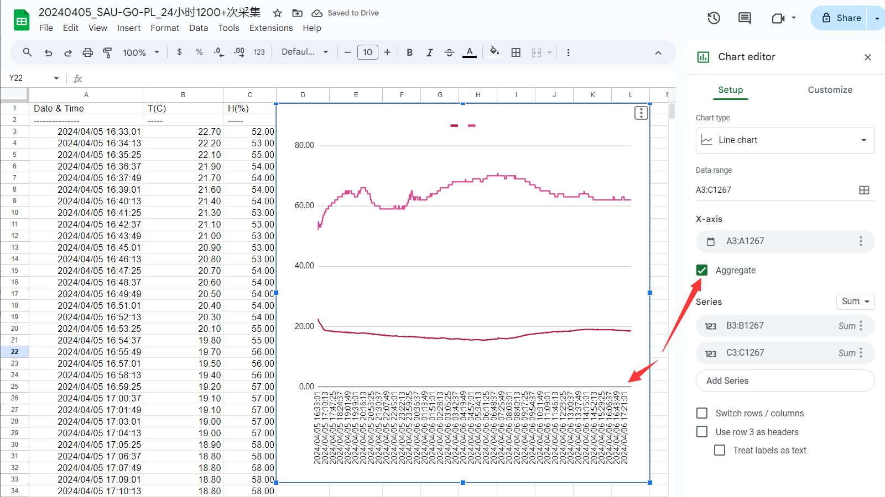

## 谷歌表格绘制折线图技巧

将SAU-G0串口导出的采样数据复制，保存在csv文件中，然后参考[How to Import a CSV into Google Sheets: 3 Best Methods](https://www.youtube.com/watch?v=9x_9aidgVRA)将csv导入Google sheet，得到可编辑的表格数据

折线图选择数据时Invalid报错的原因是数据是文本，没有格式化为数字

所以要首先对原始的文本温湿度数据格式化为Number类型

然后把文本类型的日期时间也格式化为自定义格式

完成效果

选定数据范围即可出图

