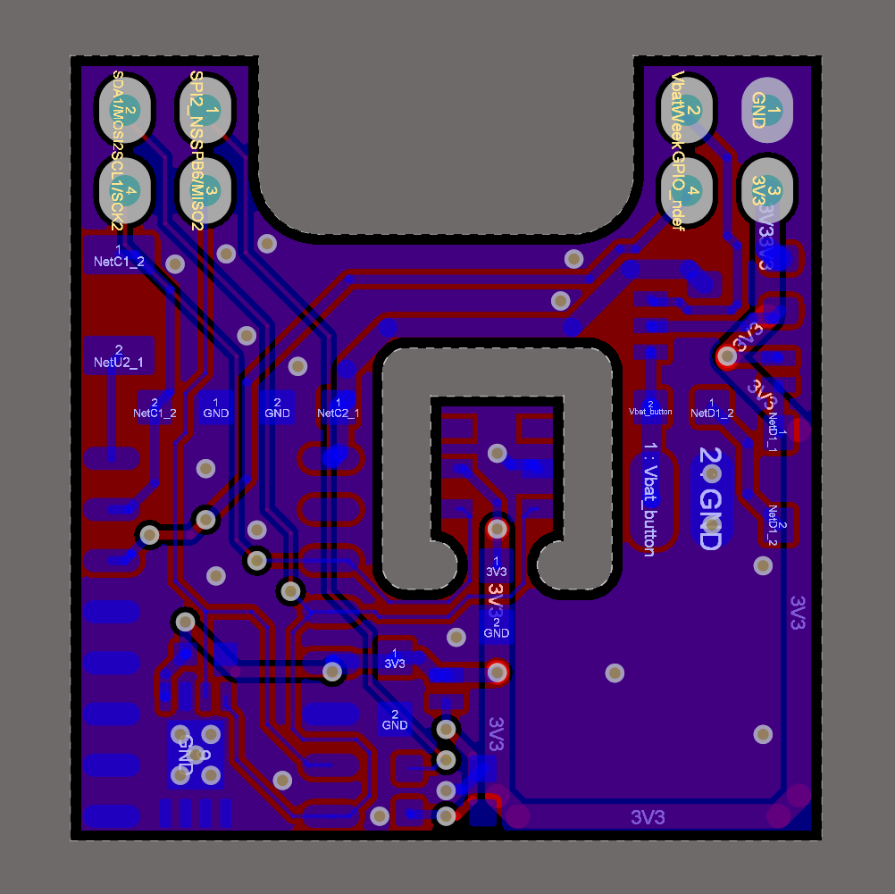

## SAU-G0

> 某存在感很弱的屑温湿度计（）

- [1. 简介](#1-简介)
- [2. 续航](#2-续航)
  - [最低电流](#最低电流)
  - [最高电流](#最高电流)
  - [理论续航时间](#理论续航时间)
- [3. PCB](#3-pcb)
  - [SAU-G0（主控板）](#sau-g0主控板)
  - [SAU-G0-EX_AHT-GL（拓展版-AHT温湿度计-普通级）](#sau-g0-ex_aht-gl拓展版-aht温湿度计-普通级)
  - [SAU-G0-EX_AHT-PL（拓展版-AHT温湿度计-精准级）](#sau-g0-ex_aht-pl拓展版-aht温湿度计-精准级)
  - [SAU-G0-EX_microSD（拓展版-microSD）](#sau-g0-ex_microsd拓展版-microsd)
- [4. 焊接](#4-焊接)
- [5. BOM](#5-bom)
- [6. 软件](#6-软件)
  - [搭建环境](#搭建环境)
  - [功能进度](#功能进度)
  - [BUG fix progress](#bug-fix-progress)
- [7. 烧录](#7-烧录)
  - [ST-LINK](#st-link)
  - [ISP](#isp)
- [8. 成品](#8-成品)
- [9. 数据采集测试](#9-数据采集测试)
- [10. Acknowledgments](#10-acknowledgments)

## 1. 简介

SAU-G0（Sensor Acquisition Uinit（传感器采集单元），基于STM32G031G8U6，是本id学习低功耗的试水作品

## 2. 续航

### 最低电流

休眠：约8uA

亮屏运行：约4.0mA（1%屏幕亮度，WS2812不供电）

### 最高电流

最大电流30mA以上（OLED屏幕亮度100%，WS2812两通道LED亮度100%）

### 理论续航时间

使用CubeMX tools工具粗略计算（未引入唤醒瞬间的电流）：1%的时间运行，99%的时间休眠，每天运行864秒（屏幕亮度为1%），其他时间休眠，那么100mA锂电池极限续航2个月7天

如果每10分钟采集温湿度数据一次，每天采集144次，每次5秒，每天耗时720秒，还剩余144秒可支持每天以1%的亮度亮屏2分钟

每组带两位小数的温湿度数据占用4byte（16bit + 16bit），每天储存576byte数据，2个月采集温湿度数据8640组，占用34560byte空间（需使用24C512 EEPROM（65536byte）存储）

.png)

## 3. PCB

> PCB采用叠板设计，分为主控板与拓展板，具体应用取决于拓展板上的传感器和存储芯片，你可以绘制自己的拓展板写驱动程序

### SAU-G0（主控板）

- 硬件：STM32G031G8U6 + CH343P + LIS3DH + TPS63000 / TPS63001 + TP4054 / MCP73831-2ATI/OT

|  |  |  |
| -------------------------------------------------- | -------------------------------------------------------- | --------------------------------- |

- USB：由于只有一个Type-C，且休眠时（STOP1模式）固件没有禁用SWD接口功能（为了防止变砖，虽然STOP1模式用不了SWD），实测如果SWD接口用排阻连CH343的D+和D-会消耗200uA以上的电流，所以Type-C采用正反插不同功能，正插G031的SWD接口用于调试，反插USB转TTL串口，这样既保留功能也避免了电流泄露
- 串口芯片：可选焊接板载的CH343P，若想外接串口芯片节约成本，可焊接上图CH343P右边的两个焊接跳线，那么G031的USART2就与Type-C直连了
- 有源晶振：默认不焊接，使用内部振荡器，预留给更高精度的时钟应用，例如不使用拓展板的外置RTC，而使用G031内部的RTC，时钟源使用外部32.768Khz有源晶振

### SAU-G0-EX_AHT-GL（拓展板-AHT温湿度计-普通级）

- 硬件：AHT20 + 24Cxx + PCF8563 + WS2812

|  |  |  |
| ------------------------------------------------------------ | ------------------------------------------------------------ | ------------------------------------------------------------ |

### SAU-G0-EX_AHT-PL（拓展板-AHT温湿度计-精准级）

- 硬件：AHT20 + 24Cxx + PCF2129 + WS2812

|  |  |  |
| ------------------------------------------------------------ | ------------------------------------------------------------ | ------------------------------------------------------------ |

### SAU-G0-EX_microSD（拓展板-microSD）

- 硬件：microSD卡或NOR Flash + 12mm蜂鸣片
- 备注：无传感器和RTC芯片，整活儿专用，目前暂未写固件

|  |  |  |
| ------------------------------------------------------------ | ------------------------------------------------------------ | ------------------------------------------------------------ |

## 4. 焊接

SAU-G0主控单元有80多个元件，元件很密集（0402、扁平无引脚封装），十分建议开钢网

## 5. BOM

交互BOM，浏览器打开即可

路径：每一个AD工程目录下的 BOM/bom

电容耐压：OLED外围电路的几个电容标注了耐压要求，其他的电容默认10V耐压或以上

电池型号：601417 3.7V 100mAh

电池连接器：非必须，可以直接焊线

EEPROM：程序实现了容量 2Kbit-1024Kbit 自适应，推荐24C512

**OLED屏幕和FPC按键需要从豆总1.6元电子烟主板车上拆**（没有这个，但想DIY的朋友可以私信我给你寄）

## 6. 软件

### 搭建环境

打包的STM32CubeIDE1.7.0工程，需要先安装暗黑主题（[教程](https://blog.csdn.net/qq_42038029/article/details/99735688?utm_medium=distribute.pc_relevant.none-task-blog-title-2&spm=1001.2101.3001.4242)），然后随便编译/折腾

### 功能进度

目前固件已完成对AHT-GL和AHT-PL拓展板适配

- [x] 屏幕渐亮渐暗
- [x] 串口修改时间
- [x] 串口导出EEPROM储存的采集数据
- [x] 多级菜单
- [x] 自定义采集温湿度任务，自动计算任务数据存储空间
- [x] 自动检测EEPROM容量：已测试24C02、24C64、24C128、24C512
- [x] 休眠：支持RTC、加速度计、按键三种方式唤醒
- [ ] 串口命令解释器
- [ ] 硬件看门狗
- [ ] 熄屏采集逻辑

### BUG fix progress

- [ ] 硬复位时，检测EEPROM概率出现检测容量为0
- [ ] 唤醒时概率死机

## 7. 烧录

编译好的固件：[Hex](https://github.com/oldgerman/SAU-G0/tree/master/SoftWare/Hex)

Type-C采用正反插不同功能，正插G031的SWD接口用于调试，反插USB转TTL串口

烧录时需要全程按住按钮中键不放以保持上电

### ST-LINK

Type-C 正插连接即可烧录

### ISP

板载一键下载电路，Type-C 反插连接

STM32G031G8U6出厂时option bytes默认BOOT0信号由option byte决定，**ISP烧录前，必须先使用STLINK以SWD连G031修改option bytes的nBOOT_SEL位为取消勾选，否则后续CH343P的RTS和DTR无法将G031设置为IPS模式！！！**

需要FlyMCU和开STM32CubeProgrammer 配合烧录

**按住OK键保持不放**，FlyMCU选择 **RTS低电平DTR高电平进BooTloader**，显示已连接后（FlyMCU无法对G0进行进一步操作），**即可松开OK键**，然后打开STM32CubeProgrammer（FlyMCU可不关闭，另外新版STM32CubeProgrammer ，会有RTS和DTR选项，都选择0）以 UART **波特率115200** 连接，如果一切顺利，即可进入烧录状态

你可能会问为啥不直接用STM32CubeProgrammer操作DTR和RTS而要用FlyMCU操作，因为这个功能我测试对于一键下载电路不起作用，DTR和RTS信号的波形很奇怪，但是FlyMCU可以

## 8. 成品

### 外壳

- STL模型路径：[SAU-G0/Hardware/SW_Project/STL_OUT](https://github.com/oldgerman/SAU-G0/tree/master/Hardware/SW_Project/STL_OUT)

不同的打印方式需要使用不同的打印模型：

- FDM打印：上盖和盒子得分两个件打印，模型文件使用 **单个零件**
- 树脂光固化、尼龙激光烧结打印：盖子和盒子可合并成一个模型打印，模型文件使用 **连接零件**
- STL文件名解释：**GL**是使用PCF8563扩展板的，**PL**是使用PCF2129扩展板的

PA12打印的外壳组装后效果：

| .JPG) | .JPG) |
| ------------------------------------------------------ | :----------------------------------------------------- |
| .JPG) | .JPG) |

### 裸板

SAU-G0-EX_AHT-GL 初号机，AHT20 周边忘记开槽了：

|  |  |
| ------------------------------------------ | ------------------------------------- |

后续制作的 SAU-G0-EX_AHT-GL 和 SAU-G0-EX_AHT-PL：

|  |  |
| ------------------------------------------------------------ | ------------------------------------------------------------ |

## 9. BUG

### 死机

运行时，或唤醒时，都可能死机，死机时，找一根USB线一端接5V，另一端 Type-C 反插连接温湿度计，然后拔出Type-C，即可复位STM32G031

### 扩展版

扩展板的纽扣电池保持开机亮屏才能从3V3充电，休眠或关机时无法充电，若太长时间不持续亮屏充电，由于RTC芯片持续消耗纽扣电池的能量，纽扣电池会过放电到0V

临时解决方案，例如 SAU-G0-EX_AHT-PL 扩展板，断开 SJ1跳线，将D1右端飞线到SJ2跳线的VbatWeek，这样后，即使关机了，锂电池还能经VbatWeek持续给纽扣电池充电

VbatWeek是从主板的锂电池经BAV99两个硅二极管降压取电的，压降1.1V左右。那么当主板的锂电池充满电时，即锂电池电压4.2V时，VbatWeek约3.1V，纽扣电池约3V，此时VbatWeek高于纽扣电池的电压时，RTC由VbatWeek供电（主板锂电池供电），而当锂电池低于4.1V时，纽扣电池的电压就会比VbatWeek高，RTC由纽扣电池供电，若熄屏时间太久没有唤醒，那么纽扣电池的电量会被RTC芯片持续消耗，可能出现纽扣电池的电压再次低于VbatWeek，那么纽扣电池又会充电

纽扣电池100%电量时电压约3V，0%电量时电压约2.0V，当纽扣电池低于2V时，主板锂电池也差不多低于3V触发锂电池保护板的过放电保护了，这个时候用户也会发现差不多没电了，需要充电

总之，纽扣电池和VbatWeek是通过二极管进行相互交替给RTC芯片供电的，在大多数情况下，当主板锂电池没电时，纽扣电池还能维持RTC芯片正常运转（MS621FE纽扣电池约5.5mAh，能维持RTC芯片（PCF2129：0.7uA）300天）

| 锂电池4.21V时，3.3V给纽扣电池充电，充满时纽扣电池的电压      | 锂电池4.20V时，VbatWeek的电压                         |
| ------------------------------------------------------------ | ----------------------------------------------------- |
|  |  |

后续有空就改一下PCB扩展版修这个电路BUG，如果我没有改，你也可以自己修改源文件

## 10. 数据采集测试

屏幕亮度90%，开启自动休眠，设置任务后，由RTC闹钟唤醒亮屏4秒，采集一次温湿度，数据保存在EEPROM，然后熄屏进入低功耗模式，在24小时如此反复约1200次，锂电池电压从4.2V降到4.0V，耗电约15%

采集数据的Excel文件位于[Data](https://github.com/oldgerman/SAU-G0/tree/master/Data)文件夹

[谷歌表格绘制折线图技巧](https://github.com/oldgerman/SAU-G0/tree/master/Data/谷歌表格绘制折线图技巧.md)

## 11. Acknowledgments

- 感谢[豆老板](https://oshwhub.com/red_bean)谈下1.6元电子烟主板车车
- 感谢 [JLC](https://www.jlc.com/) 制造的高品质 PCB
- 感谢稚晖 [Planck-Pi](https://github.com/peng-zhihui/Planck-Pi) 的 Type-C 正反插两用的灵感
