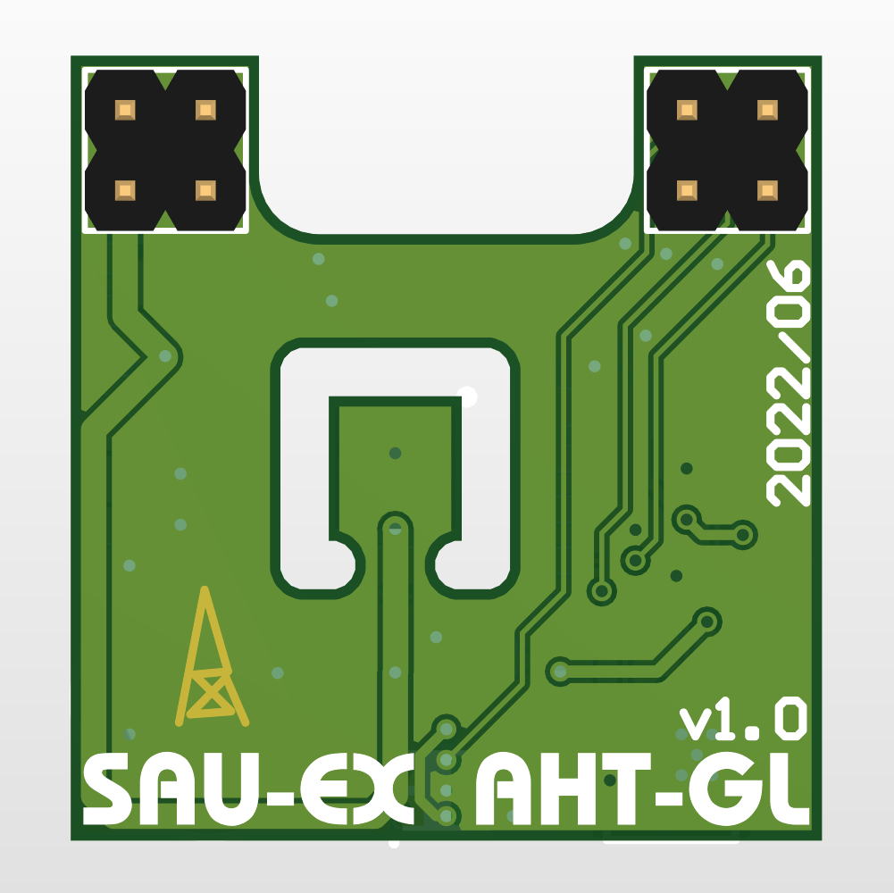

- [1. 简介](#1-简介)
- [2. 续航](#2-续航)
  - [最低电流](#最低电流)
  - [最高电流](#最高电流)
  - [理论续航时间](#理论续航时间)
- [3. PCB](#3-pcb)
  - [SAU-G0（主控板）](#sau-g0主控板)
  - [SAU-G0-EX_AHT-GL（拓展版-AHT温湿度计-普通级）](#sau-g0-ex_aht-gl拓展版-aht温湿度计-普通级)
  - [SAU-G0-EX_AHT-PL（拓展版-AHT温湿度计-精准级）](#sau-g0-ex_aht-pl拓展版-aht温湿度计-精准级)
  - [SAU-G0-EX_microSD（拓展版-microSD）](#sau-g0-ex_microsd拓展版-microsd)
- [4. 焊接](#4-焊接)
- [5. BOM](#5-bom)
- [6. 软件](#6-软件)
  - [搭建环境](#搭建环境)
  - [功能进度](#功能进度)
  - [BUG fix progress](#bug-fix-progress)
- [7. 烧录](#7-烧录)
  - [ST-LINK](#st-link)
  - [ISP](#isp)
- [8. 成品](#8-成品)
- [9. 数据采集测试](#9-数据采集测试)
- [10. Acknowledgments](#10-acknowledgments)

## 1. 简介

SAU-G0（Sensor Acquisition Uinit（传感器采集单元），基于STM32G031G8U6，是本id学习低功耗的试水作品

## 2. 续航

### 最低电流

休眠：约8uA

亮屏运行：约4.0mA（1%屏幕亮度，WS2812不供电）

### 最高电流

最大电流30mA以上（OLED屏幕亮度100%，WS2812两通道LED亮度100%）

### 理论续航时间

使用CubeMX tools工具粗略计算（未引入唤醒瞬间的电流）：1%的时间运行，99%的时间休眠，每天运行864秒（屏幕亮度为1%），其他时间休眠，那么100mA锂电池极限续航2个月7天

如果每10分钟采集温湿度数据一次，每天采集144次，每次5秒，每天耗时720秒，还剩余144秒可支持每天以1%的亮度亮屏2分钟

每组带两位小数的温湿度数据占用4byte（16bit + 16bit），每天储存576byte数据，2个月采集温湿度数据8640组，占用34560byte空间（需使用24C512 EEPROM（65536byte）存储）

.png)

## 3. PCB

> PCB采用叠板设计，分为主控板与拓展板，具体应用取决于拓展板上的传感器和存储芯片，你可以绘制自己的拓展板写驱动程序

### SAU-G0（主控板）

- 硬件：STM32G031G8U6 + CH343P + LIS3DH + TPS63000 / TPS63001 + TP4054 / MCP73831-2ATI/OT

|  |  |  |
| -------------------------------------------------- | -------------------------------------------------------- | --------------------------------- |

- USB：由于只有一个Type-C，且休眠时（STOP1模式）固件没有禁用SWD接口功能（为了防止变砖，虽然STOP1模式用不了SWD），实测如果SWD接口用排阻连CH343的D+和D-会消耗200uA以上的电流，所以Type-C采用正反插不同功能，正插G031的SWD接口用于调试，反插USB转TTL串口，这样既保留功能也避免了电流泄露
- 串口芯片：可选焊接板载的CH343P，若想外接串口芯片节约成本，可焊接上图CH343P右边的两个焊接跳线，那么G031的USART2就与Type-C直连了
- 有源晶振：默认不焊接，使用内部振荡器，预留给更高精度的时钟应用，例如不使用拓展板的外置RTC，而使用G031内部的RTC，时钟源使用外部32.768Khz有源晶振

### SAU-G0-EX_AHT-GL（拓展版-AHT温湿度计-普通级）

- 硬件：AHT20 + 24Cxx + PCF8563 + WS2812

|  |  |  |
| ------------------------------------------------------------ | ------------------------------------------------------------ | ------------------------------------------------------------ |

### SAU-G0-EX_AHT-PL（拓展版-AHT温湿度计-精准级）

- 硬件：AHT20 + 24Cxx + PCF2129 + WS2812

|  |  |  |
| ------------------------------------------------------------ | ------------------------------------------------------------ | ------------------------------------------------------------ |

### SAU-G0-EX_microSD（拓展版-microSD）

- 硬件：microSD卡或NOR Flash + 12mm蜂鸣片
- 备注：无传感器和RTC芯片，整活儿专用，目前暂未写固件

|  |  |  |
| ------------------------------------------------------------ | ------------------------------------------------------------ | ------------------------------------------------------------ |

## 4. 焊接

SAU-G0主控单元有80多个元件，元件很密集（0402、扁平无引脚封装），十分建议开钢网

## 5. BOM

交互BOM，浏览器打开即可

路径：每一个AD工程目录下的 BOM/bom

电容耐压：OLED外围电路的几个电容标注了耐压要求，其他的电容默认10V耐压或以上

电池型号：601417 3.7V 100mAh

电池连接器：非必须，可以直接焊线

EEPROM：程序实现了容量 2Kbit-1024Kbit 自适应，推荐24C512

## 6. 软件

### 搭建环境

打包的STM32CubeIDE1.7.0工程，需要先安装暗黑主题（[教程](https://blog.csdn.net/qq_42038029/article/details/99735688?utm_medium=distribute.pc_relevant.none-task-blog-title-2&spm=1001.2101.3001.4242)），然后随便编译/折腾

### 功能进度

目前固件已完成对AHT-GL和AHT-PL拓展板适配

- [x] 屏幕渐亮渐暗
- [x] 串口修改时间
- [x] 串口导出EEPROM储存的采集数据
- [x] 多级菜单
- [x] 自定义采集温湿度任务
- [x] 自动检测EEPROM容量：已测试24C02、24C128、24C512
- [x] 休眠：支持RTC、加速度计、按键三种方式唤醒
- [ ] 串口命令解释器
- [ ] 硬件看门狗
- [ ] 熄屏采集逻辑

### BUG fix progress

- [ ] 硬复位时，检测EEPROM概率出现检测容量为0
- [ ] 唤醒时概率死机

## 7. 烧录

Type-C采用正反插不同功能，正插G031的SWD接口用于调试，反插USB转TTL串口

烧录时需要全程按住按钮中键不放以保持上电

### ST-LINK

Type-C 正插连接即可烧录

### ISP

板载一键下载电路，Type-C 反插连接

STM32G031G8U6出厂时option bytes默认BOOT0信号由option byte决定，需要先使用STLINK更改option bytes的

需要FlyMCU和开STM32CubeProgrammer 配合烧录

 FlyMCU选择 RTS低电平DTR高电平进BooTloader，显示已连接后（FlyMCU无法对G0进行进一步操作），打开STM32CubeProgrammer（新版STM32CubeProgrammer ，会有RTS和DTR选项，都选择0） 以UART连接即可烧录

你可能会问为啥不直接用STM32CubeProgrammer操作DTR和RTS而要用FlyMCU操作，因为这个功能我测试对于一键下载电路不起作用，DTR和RTS信号的波形很奇怪，但是FlyMCU可以

## 8. 成品

（外壳待验证）

|  |  |  |
| ------------------------------------------ | ------------------------------------- | ------------------------------------- |

## 9. 数据采集测试

自动休眠唤醒，每分钟采集一次，一晚上采集了565组温湿度数据（如上最右图）

每次从休眠中唤醒，亮屏运行10秒，一晚上耗电5%，熄屏采集的话耗电可以更低，目前程序还未加入

## 10. Acknowledgments

- 感谢豆老板](https://oshwhub.com/red_bean)谈下1.6元电子烟主板车车
- 感谢 [JLC](https://www.jlc.com/) 制造的高品质 PCB
- 感谢稚晖 [Planck-Pi](https://github.com/peng-zhihui/Planck-Pi) 的 Type-C 正反插两用的灵感
