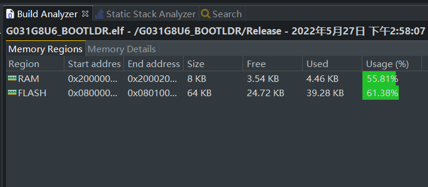
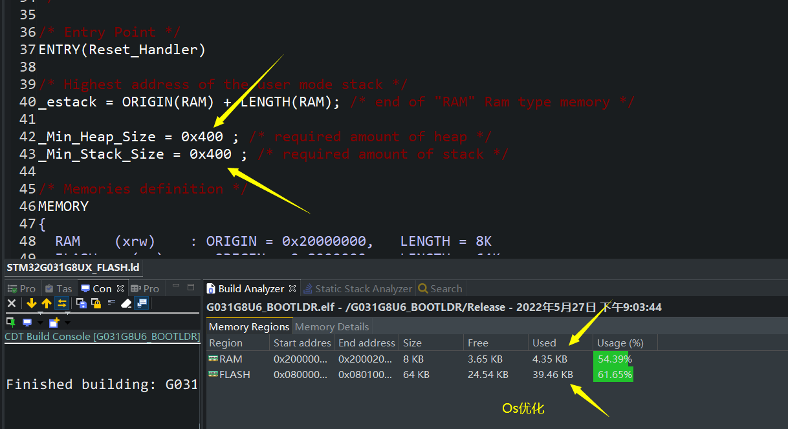
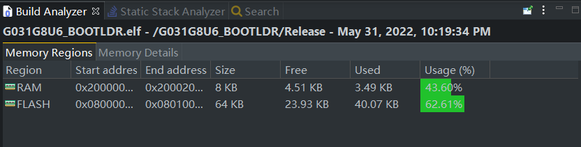
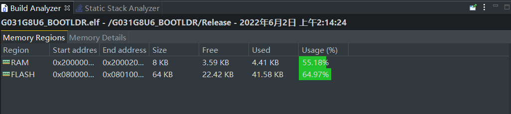
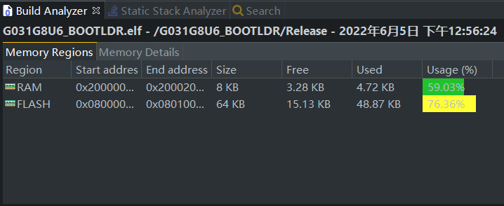

## 2022/05/27  15:40

去掉FreeRTOS，改用X-TRACK里的[MillisTaskManager](https://github.com/FASTSHIFT/X-TRACK/tree/main/Software/X-Track/Libraries/MillisTaskManager)库

### 内存分配及占用

RAM包含堆栈各0x400（1KB）

### 同时运行

单按键开机、长按关机正常

运动检测正常

温湿度正常

RTC正常

串口修改RTC时间正常

按键 Buttons所有状态测试正常

所有多级菜单`vector<Colum>`创建正常，成功跑起来多级菜单

### Page类

ODGIRON烙铁 旧版本代码 跑三个以上的栏会有bug

改成支持不限制多少个的了

## 2022/05/27  21:04

### 内存分配及占用

RAM包含堆栈各0x400（1KB）

### 功能正常

### Page类

添加遮罩矩形，用于Colum的str与val和unit显示重叠时的情况，可以在修改值时遮罩住一部分str中文字符，非修改模式，可以同时长短或长按左右键，快速显示本页由于str太长而不显示的val和unit部分

### 统一改为uint16_t

systemSettings、eepromSettings中需要由Colum修改的、原本uint8_t全改为uint16，AutoValue将`void* val`改回 `uint16_t *val`，因为operator()会解引用val为一个固定类型，如果是`*uint8_t`解引用成`*uint_16_t`会发生非法访问导致程序崩溃，没有必要为节约1byte的EEPROM空间而搞这么麻烦的`void*`指针实现的泛型类，问题一堆，我改回去了，相关的`*(uint?_t*)(ptrColum->ptrAutoValue->val)`省去了前面的强制转换部分，flash和ram剩余空间还增加了小几百byte，tmd就离谱。。。

## 2022/05/31 21:22

将ee24打包到EE24类，添加自动检测EEPROM容量和页大小的函数，分离出read和write内预处理器检测容量更改传入HAL_I2C API的方式到`EE24::autoInit()`中配置

将RTClib的I2C bit和bits基于mask修改的read和write函数重写了一套基于HAL_I2C_MasterTransmit和Receive的在RTC_I2C类中，由其他RTC派生类可继承

PCF2129的设置闹钟中断由G031 PB5下降沿中断回调测试OK，Buid Analyzer 这个内存没有分别系统堆（0x00），居然也能正常运行也是奇了怪，正常不是3.49而是4.49KB

## 2022/06/02 02:14

### 找出操作位域的Colum进入改值函数时可能卡死的bug

从内存定位附近的flash地址，发现是columAdjust里面，运行到执行函数指针，funLoc这个枚举类在这个构造函数里没有给默认初始化值，而其他Colum构造函数要么有默认初始化值，要么必须给齐传参数，给加上默认初始化值，再次Os优化编译，这个bug消失！

### 功能实现进度

数据采集-->任务设置的所有

数据采集-->任务进度

## 2022/06/05 12:57

### 功能实现进度

新增外设：ADC 16bit模式 + DMA（裸编译占用 RAM：+0.23KB、FLASH：+3KB)

新增其他：RAM：+0.08KB、FLASH：+4.29KB

- 新页：导出数据
- 新页：更改时间
- 新页：扫描设备

- 新页：版本信息

- 新页：电池

- 开机logo

- 屏幕熄屏亮屏

## 20220606

修改了仓库名称
