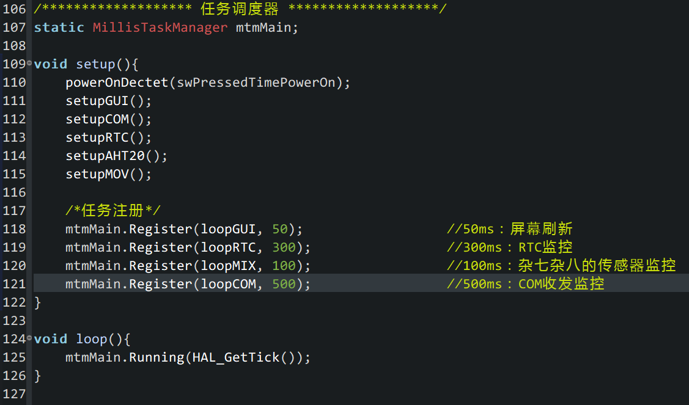

## 2022/05/27  15:40

去掉FreeRTOS，改用X-TRACK里的[MillisTaskManager](https://github.com/FASTSHIFT/X-TRACK/tree/main/Software/X-Track/Libraries/MillisTaskManager)库

## 内存分配及占用

RAM包含堆栈各0x400（1KB）

## 同时运行

单按键开机、长按关机正常

运动检测正常

温湿度正常

RTC正常

串口修改RTC时间正常

按键 Buttons所有状态测试正常

所有多级菜单`vector<Colum>`创建正常，成功跑起来多级菜单

## Page类

ODGIRON烙铁 旧版本代码 跑三个以上的栏会有bug

改成支持不限制多少个的了
